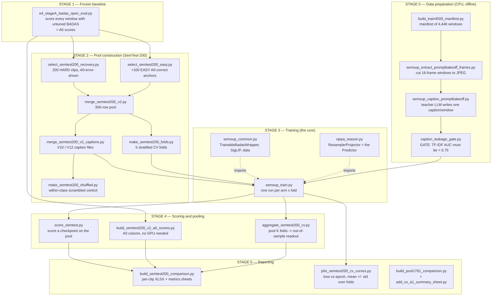
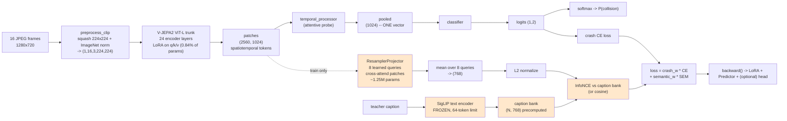

# Code Reading Guide — `e4_vjepa_reason` and `semtest200_v2`

**Purpose.** Read the code that produced `outputs/e4_vjepa_reason/` and
`outputs/semtest200_v2/` without having written it, and without assuming fluency in Python.
Written for a reader comfortable in **MATLAB and C** — every non-obvious Python or PyTorch
idiom is explained where it first appears.

**How to use it.** Read §1 once (Python primer), skim §2–§4 (what the experiment is, the block
diagram), then keep §5 open beside the actual source. §6 is a review list — things I think
should change, with reasoning and the risk of changing them.

**Status.** Descriptive, not normative. It documents the code as it exists on `main`. It does
**not** modify any source file. Everything I would change is proposed in §6 for your approval.

---

## Table of contents

| § | Section | Read it when |
|---|---|---|
| 1 | [Python for MATLAB/C readers](#1-python-for-matlabc-readers) | First, once |
| 2 | [What the experiment actually is](#2-what-the-experiment-actually-is) | First, once |
| 3 | [Block diagram](#3-block-diagram) | Reference |
| 4 | [What each block does](#4-what-each-block-does) | Reference |
| 5 | [Script-by-script, section-by-section](#5-script-by-script-section-by-section) | While reading source |
| 6 | [Proposed code changes](#6-proposed-code-changes--raised-not-applied) | Review session |
| 7 | [Compatibility](#7-compatibility--which-experiments-this-guide-covers) | Before reusing |
| 8 | [Suggested reading order](#8-suggested-reading-order) | First, once |

---

## 1. Python for MATLAB/C readers

Only constructs that actually appear in this codebase.

### 1.1 Indentation is the block delimiter

No braces, no `end`. The colon opens a block; 4-space indentation is the body. Enforced by the
parser, not by style.

```python
if x > 0:            # C:  if (x > 0) {
    y = 1            #         y = 1;
    z = 2            #         z = 2;
                     #     }
w = 3                # outside the if
```

### 1.2 No type declarations; `None` is the null

```python
n = 0                 # int
x = 0.5               # float
s = "text"            # str
p = None              # the null/empty value. MATLAB [] , C NULL.
```

`x: float = 0.5` and `def f(a: int) -> str:` are **type hints** — documentation only, never
enforced at runtime. Read them as comments.

### 1.3 The four container types

| Python | Literal | MATLAB analogue | Note |
|---|---|---|---|
| `list` | `[1, 2, 3]` | cell array / vector | ordered, mutable, **0-indexed** |
| `tuple` | `(1, 2, 3)` | — | ordered, **immutable** |
| `dict` | `{"a": 1}` | `struct` | key→value, keys usually strings |
| `set` | `{1, 2, 3}` | `unique()` + membership | unordered, no duplicates, O(1) `in` |

**Indexing is 0-based and the stop is exclusive** — the main MATLAB tripwire:

```python
a = [10, 20, 30, 40]
a[0]      # 10   (MATLAB a(1))
a[-1]     # 40   negative counts from the end
a[1:3]    # [20, 30]   start INCLUSIVE, stop EXCLUSIVE
a[:2]     # [10, 20]
a[2:]     # [30, 40]
```

`set` is used heavily for fast membership. `x in some_set` is O(1); `x in some_list` is O(n).
You will see `val_vids = {line.strip() for line in f}` built as a set precisely so the later
`if ex["video_id"] not in val_vids` is cheap.

### 1.4 Dict access: `[...]` vs `.get(...)`

```python
d = {"a": 1}
d["a"]                # 1
d["b"]                # CRASH (KeyError)
d.get("b")            # None   - no crash
d.get("b", 0)         # 0      - no crash, your default
```

This distinction is **load-bearing** here. `r["video_id"]` means "must exist, crash loudly if
the data is malformed". `r.get("group")` means "optional". A change between the two forms in a
diff is a semantic change, not cosmetics.

### 1.5 Comprehensions

A `for` loop that builds a container, on one line. The most common idiom you will meet.

```python
squares = [x*x for x in range(10)]           # list
evens   = [x for x in data if x % 2 == 0]     # with a filter
lookup  = {r["id"]: r for r in rows}          # dict
vids    = {r["video_id"] for r in rows}       # set (dedupes)
```

C equivalent of the second:

```c
for (i = 0, j = 0; i < n; i++)
    if (data[i] % 2 == 0) evens[j++] = data[i];
```

Read the `for` clause first (what am I looping over), then `if` (what do I keep), then the
leading expression (what goes in the output). From `semsup_train.py`:

```python
train_ex = [e for e in examples if e["video_id"] not in val_vids]
```

= "train_ex is every example whose video_id is not in the val set".

### 1.6 f-strings

```python
print(f"epoch {epoch}/{args.epochs}  val_ap={val_ap:.4f}  ({elapsed:.1f}s)")
```

The `f` prefix substitutes `{...}`. `:.4f` is C's `%.4f`. `:,` adds thousands separators
(`f"{n:,}"` → `2,801,664`). `:>10.4f` right-aligns in a 10-wide field. Same semantics as
`printf`, different syntax.

### 1.7 Functions, defaults, keyword arguments

```python
def evaluate_val(badas, examples, device, predictor=None, semantic_loss="cosine"):
```

- `badas, examples, device` — required positional.
- `predictor=None, semantic_loss="cosine"` — defaults; callers may omit.
- Callers may pass **by name, in any order**: `evaluate_val(b, ex, dev, semantic_loss="infonce")`.

That is why call sites here look verbose — they name nearly every argument. Deliberate: with 15
parameters, positional calls are unreadable and fragile.

> **The one Python trap worth knowing:** a mutable default (`def f(x=[])`) is created **once**
> at definition time and shared across all calls. This codebase correctly uses `=None` and
> builds the container inside. If you ever see `=[]` or `={}` as a default, that is a bug.

### 1.8 Tuple unpacking / multiple returns

Python returns multiple values as a tuple; the caller destructures. MATLAB's `[a,b] = f()`.

```python
val_ap, val_crash_loss, val_sem_loss, n_failed, retrieval_stats = evaluate_val(...)
```

The count must match exactly. Hence `PROJECT_STATE.md`'s warning: *"`evaluate_val()`'s 5-tuple
return — don't unpack it as a 4-tuple in any new script."* It used to return 4; `retrieval_stats`
was appended; any old call site now crashes with `ValueError: too many values to unpack`.

`_` is the conventional throwaway name:

```python
for _, ex, clip, err in badas.prefetch_clips(...):   # ignore the index
```

### 1.9 Generators and `yield` — the one genuinely unfamiliar concept

A normal function `return`s once. A function containing `yield` is a **generator**: it produces
a sequence lazily, **suspending and resuming** its own execution between items.

```python
def count_to(n):
    for i in range(n):
        yield i          # hand out this value, then FREEZE here until asked for the next

for x in count_to(3):    # 0, 1, 2 - but no list of 3 items is ever built
    print(x)
```

No clean C analogue — it is a coroutine. Closest mental model: a hardware FIFO whose producer
blocks when the consumer is not reading.

**Why it matters here:** `prefetch_clips()` is a generator. It hands the training loop one
preprocessed clip at a time while background threads decode the next 16. A list would require
holding an entire epoch of clips in RAM.

### 1.10 `with` blocks (deterministic cleanup)

```python
with open(path, encoding="utf-8") as f:
    data = f.read()
# file guaranteed closed here, even if an exception was raised inside
```

RAII, essentially — which is why you rarely see an explicit `close()`.

### 1.11 Exceptions instead of return codes

```python
try:
    risky()
except (OSError, RuntimeError) as e:      # catch only these two types
    print(f"failed: {e}")
```

`raise ValueError("msg")` throws; uncaught exceptions terminate with a stack trace.

**This codebase uses exceptions deliberately as a safety mechanism.** `build_frames_dir_index()`
raises on a conflicting `frames_dir` because, per its own docstring, *"a silently-resolved-wrong
frames_dir is a much worse failure than a crash."* That philosophy runs throughout: fail loudly
rather than train on wrong data for six hours.

### 1.12 Classes and `self`

```python
class TrainableBadasWrapper:
    def __init__(self, cfg, lora_r=16):    # constructor
        self.lora_r = lora_r                # instance field
    def forward(self, frame_paths):         # method
        return self.lora_r                  # 'self' is EXPLICIT, always the 1st parameter
```

`self` is C++'s `this`, but written out as the first parameter of every method. Construction is
`w = TrainableBadasWrapper(cfg)` — no `new`. A leading underscore (`self._captured`,
`_clip_grads`) is a **convention** meaning private; not enforced.

### 1.13 `if __name__ == "__main__":`

Run `main()` only if this file was executed directly, not when imported by another file. It is
how one file is both a runnable program and an importable library. Every script here ends
with it.

### 1.14 `argparse` — the command-line interface

```python
ap = argparse.ArgumentParser()
ap.add_argument("--epochs", type=int, default=8)
ap.add_argument("--unfreeze-head", action="store_true")   # a flag: present = True
args = ap.parse_args()
print(args.epochs)     # --unfreeze-head becomes args.unfreeze_head (dash -> underscore)
```

**In this codebase, reading `semsup_train.py`'s `add_argument` block is the fastest way to
understand the experiment.** The `help=` strings are unusually detailed and record *why* each
knob exists and what went wrong when it was set incorrectly.

### 1.15 PyTorch: the four things you need

**(a) A tensor is an N-D array with an attached derivative graph.** Shapes appear in comments as
tuples: `(1, 2)` = 1 row × 2 cols; `(P, D)` = P patches × D features.

**(b) Autograd.** Operations on tensors with `requires_grad=True` are recorded.
`loss.backward()` walks that recording backwards and accumulates ∂loss/∂p into each parameter's
`.grad`. Automatic differentiation — same idea as a hand-derived gradient, computed by the
framework.

Critically, **`.backward()` accumulates, it does not overwrite** — hence:

```python
loss.backward()        # accumulate d(loss)/d(param) into param.grad
opt.step()             # param -= lr * grad   (AdamW's variant)
opt.zero_grad()        # clear .grad for the next step
```

**(c) `.detach()` cuts the graph.** Returns the same numbers with the derivative link severed.
Its *absence* is load-bearing here — `semsup_common.py`'s hook carries
`# NOTE: no .detach() -> keeps grad`, because the entire point of the semantic branch is that
gradient must flow from the caption loss back into the vision trunk.

**(d) `torch.no_grad()`** disables recording for a block — used in evaluation: forward pass, no
graph, far less memory.

**Two model modes:** `model.train()` / `model.eval()`. These do not train or evaluate anything;
they switch dropout and batch-norm behavior. Forgetting `.eval()` before validation is a classic
silent bug.

### 1.16 Small idioms you will hit

```python
Path("a") / "b" / "c.txt"       # pathlib: OS-independent join. The / is overloaded.
d.setdefault(k, []).append(v)   # get d[k], creating [] if absent, then append
sorted(xs, key=lambda r: r[1], reverse=True)   # sort by 2nd element, descending
                                                # lambda = anonymous fn; MATLAB @(r) r(2)
x == x                          # FALSE only for NaN  -> a NaN test with no import. C isnan().
-(-n // k)                      # integer ceiling division, ceil(n/k). // is floor division.
{**a, "extra": 1}               # dict copy/merge with an added key
enumerate(xs)                   # yields (index, value)
zip(a, b)                       # yields (a[i], b[i]), stops at the shorter
```

The `x == x` NaN idiom appears throughout the metrics code and matters: IEEE-754 says NaN is not
equal to itself, so `x == x` is False exactly when x is NaN.

---

## 2. What the experiment actually is

### 2.1 The research question in one sentence

> Does supervising a vision model with **language during training only** improve its
> collision-anticipation accuracy, when inference stays **vision-only** at zero added cost?

Formally, three arms:

| Arm | Trunk | Loss | Meaning |
|---|---|---|---|
| **A0** | frozen BADAS-Open | none (no training) | the off-the-shelf baseline |
| **A1** | LoRA-tuned | crash CE only | **the control** — does fine-tuning alone help? |
| **B** | LoRA-tuned | crash CE + λ·semantic | **the treatment** — does language add anything on top? |

The claim of interest is `B − A1`, not `B − A0`. A1 is the honest control because it isolates
the *semantic* contribution from the *fine-tuning* contribution.

### 2.2 The answer so far (so you read the code knowing where it lands)

- **A1 won and is banked:** test AP 0.853 → **0.900** (+0.047) on the 677-clip Private test set.
  A real, standalone, publishable result.
- **Every B arm has lost or tied** at the 1,761-window scale.
- **SemTest-200** (300 clips, cross-validated) was built to test *why* — specifically the
  hypothesis that the frozen crash head cannot recalibrate after LoRA moves the trunk's features
  (Kumar et al., ICLR 2022, "Fine-Tuning can Distort Pretrained Features").
- The v12-vs-v12shuffled control (real captions vs. class-preserving scrambled captions) landing
  within noise of each other is the cleanest single piece of evidence that caption **content**
  is not reaching the score at this scale.

This is a **negative-result thread with a clean control**, and the code is built accordingly —
heavily instrumented with diagnostics whose purpose is to distinguish "the idea does not work"
from "the experiment was executed wrong". That instrumentation is most of what you will read in
§5, so it is worth knowing it is there on purpose.

### 2.3 Vocabulary you must have straight

| Term | Meaning |
|---|---|
| **clip / video** | one Nexar dashcam video, identified by `video_id` |
| **window** | 16 consecutive frames cut from a clip at a given time offset |
| **TTE** | time-to-event: seconds *before* the collision (`TTE_0.5/1.0/1.5`) |
| **MID-n** | for negatives: offset from the clip midpoint (no event exists to count down to) |
| **A clip is not a window** | 1,761 windows come from 1,107 unique clips. Splitting by row leaks. |
| **LoRA** | low-rank adapters: freeze the big weights, train small `B·A` deltas (~0.84% of params) |
| **crash head** | `temporal_processor` + `classifier` — collapses patches to one vector, then scores |
| **Predictor** | `ResamplerProjector` — the train-only semantic branch, discarded at inference |
| **A0/A1/B/P1** | arm names — see §2.1; P1 = two-stage (semantic first, then crash) |

> **The single most important invariant in this codebase:** splits are **by `video_id`, never by
> row**. One clip contributes up to 3 TTE windows with near-identical content and an identical
> label. Splitting per-row puts the same scene in train and val, which inflates every metric.
> `clip_level_split()` exists solely for this.

---

## 3. Block diagram

### 3.1 Pipeline — offline data prep → training → reporting



### 3.2 Model — what one training step actually computes



Everything shaded is **train-only** and does not exist at inference. That is the whole design
claim: zero added deployment cost.

### 3.3 ASCII fallback (if Mermaid does not render in your viewer)

```
                    16 frames (1280x720)
                            |
                    preprocess_clip()          squash-resize to 224, ImageNet norm
                            |
              +-------------v--------------+
              |  V-JEPA2 ViT-L  (frozen)   |
              |  + LoRA on query/key/value |  <-- 2.8M trainable of 334M (0.84%)
              +-------------+--------------+
                            |
                   patches (2560, 1024)
                            |
            +---------------+----------------------------+
            |                                            |
            v                                            v   (TRAIN ONLY)
   temporal_processor                            ResamplerProjector
   (attentive probe)                             8 queries x-attend patches
            |                                            |
      pooled (1024)   <-- the ENTIRE basis            mean over queries
            |             for the crash decision           |
       classifier                                     normalize -> (768)
            |                                            |
      logits (1,2)                                       |    SigLIP(caption)
            |                                            |    frozen, 64 tok
      softmax -> P(collision)                            |         |
            |                                            v         v
      crash CE loss                                  InfoNCE / cosine loss
            |                                                |
            +---------------> loss = cw*CE + sw*SEM <--------+
                                        |
                                   backward()
```

---

## 4. What each block does

### Stage 0 — Data preparation

| Block | Does | Key output |
|---|---|---|
| `build_train4500_manifest.py` | Enumerates candidate windows: positives at TTE 0.5/1.0/1.5 s before the labelled event, negatives at MID-4/-8/-10 s from the clip midpoint. | `dataset/manifests/train4500_hires.jsonl` |
| `semsup_extract_promptbakeoff_frames.py` | Cuts each window to 16 sequential JPEGs at native 1280×720. | `dataset/train/<frames_dir>/frame_00001..16.jpg` |
| `semsup_caption_promptbakeoff.py` | Sends frames to a teacher LLM (via OpenRouter) with a versioned prompt (V10/V12/V13); parses and validates the response. | `Caption_*.jsonl` |
| `caption_leakage_gate.py` | **Safety gate.** Trains TF-IDF + LogisticRegression to predict the label *from caption text alone*, GroupKFold-5 by `video_id`. Target AUC < 0.75. | `leakage_gate_*.json` |

> **Why the leakage gate exists.** If captions encode the label (e.g. by always saying "collision"
> for positives), the semantic loss becomes a noisy copy of the crash label rather than an
> independent semantic signal — and any A-vs-B comparison is confounded. This is the same class
> of concern as train/test contamination, applied to an auxiliary target.

### Stage 1 — Frozen baseline (A0)

`e4_stageA_badas_open_eval.py` loads BADAS-Open untouched and scores every window. Two roles:

1. It is the **A0 arm** — the number every other arm must beat.
2. Its per-window scores **drive pool selection** in Stage 2 (which clips A0 gets wrong).

### Stage 2 — Pool construction

The interesting design decision in this whole thread.

| Block | Does | Why |
|---|---|---|
| `select_semtest200_recovery.py` | Picks 200 clips **A0 gets wrong**: 3-tier for positives (FN near-boundary, TP fill, FN wide), FP-only for negatives. | Concentrate on recoverable errors — maximum headroom to measure an improvement. |
| `select_semtest200_easy.py` | Adds 100 **easy A0-correct** clips (60 TN at score < 0.20, 40 TP at > 0.85). | The v1 pool was 100% adversarial — **zero true negatives**. A0's own AUC on it was 0.23, i.e. rank-inverted by construction. With no easy anchor, the crash gradient only learns "push down whatever scores high" — a translation, not a discrimination. |
| `merge_semtest200_v2.py` | Concatenates 200 + 100 → 300, asserts video-disjointness. | |
| `merge_semtest200_v2_captions.py` | Builds V10/V12 caption files covering all 300, reusing 28 from the 1,761 corpus and generating 72 fresh. | |
| `make_semtest200_shuffled.py` | Permutes captions **within class** (YES↔YES, NO↔NO), enforcing a derangement. | **The critical control.** If v12 beats vision-only but v12shuf does not, the effect is caption *content*. If both beat it equally, the effect is mere caption *presence* (a regularizer), not meaning. |
| `make_semtest200_folds.py` | 5 folds, stratified on `(gt_verdict, source)`, split by `video_id`. | At n=40 val the AP confidence interval is ≈ ±0.15 — wider than the entire observed between-arm spread (0.515–0.542). The single-split experiment **could not, even in principle, distinguish any arm from any other.** K-fold makes the readout 200+ rows instead of 40. |

> This is the most methodologically important part of the thread. The v1→v2 changes were not
> tuning; they were fixing an experiment that lacked the statistical power to answer its own
> question.

### Stage 3 — Training

`semsup_train.py` is the whole experiment. One process = one (arm, fold). The arm is selected
purely by two weights:

| `--crash-weight` | `--semantic-weight` | Arm |
|---|---|---|
| 1 | 0 | **A1** — crash-only control |
| 1 | > 0 | **B** — crash + semantic |
| 0 | > 0 | **P1 Stage A** — semantic only, no crash gradient reaches the trunk |

Supporting modules: `semsup_common.py` (model wrapper, data, SigLIP), `vjepa_reason.py`
(the Predictor), `metrics_core.py` (AP/AUC/F1/Brier/ECE).

### Stage 4 — Scoring and pooling

| Block | Does |
|---|---|
| `score_semtest.py` | Loads one checkpoint (LoRA adapter + optional `head_state.pt`) and scores the pool. |
| `build_semtest200_v2_a0_scores.py` | Filters the pre-existing full-pool A0 scores down to the 300 — no GPU, no pod. |
| `aggregate_semtest200_cv.py` | Pools every fold's val dump. Because each clip is held out by exactly one fold, **every score is out-of-sample.** Prints both the pooled number (higher power) and the per-fold mean ± std (conservative). |

### Stage 5 — Reporting

`build_semtest200_comparison.py` writes the per-clip XLSX with `fixed / broken / still_wrong /
net` accounting vs A0 and vs vision, plus a `metrics_stratified` sheet splitting hard/easy/all —
which is what answers "did the 100 easy clips just inflate the number".

---

## 5. Script-by-script, section-by-section

Notes are placed **at each internal block**, not only at the top of the file — per your request.
Line numbers are indicative; use the section headings to locate them.

---

### 5.1 `semsup_common.py` (458 lines) — shared plumbing

Four independent concerns in one file: data resolution, the model wrapper, the SigLIP text
encoder, and a debug entry point.

#### Block A — module header and path setup (lines 18–30)

```python
PROJECT_ROOT = Path(__file__).resolve().parents[2]
sys.path.insert(0, str(PROJECT_ROOT / "student_training" / "scripts"))
```

> **Note.** `__file__` is this source file's own path; `.parents[2]` walks up two directories.
> `sys.path.insert(0, ...)` prepends to Python's module search path — the equivalent of adding a
> directory to MATLAB's path, or `-I` on a C compiler. This makes the script runnable from any
> working directory. It is done at import time, before the imports that need it.

#### Block B — `_norm_verdict()` and `_norm_tte()` (lines 33–60)

Two normalizers that exist because different generations of data files serialize the same value
differently.

```python
def _norm_tte(tte) -> str:
    try:
        return str(float(tte))
    except (TypeError, ValueError):
        return str(tte)
```

> **Note.** `"1"` and `"1.0"` and `1` must collapse to one key, or two label files silently
> disagree about the same clip without ever comparing equal. Non-numeric TTEs (`"-4.0_offset"`,
> `"TN_MIDPOINT"`) hit the `except` branch and pass through unchanged. This is the Python
> idiom for "try to parse, fall back if it isn't a number" — C would use `strtod` and check
> `endptr`.

#### Block C — `build_frames_dir_index()` (lines 63–101)

Builds `(video_id, TTE) → frames_dir` from the teacher-label manifests.

> **Note — the deliberate crash.** The function *raises* on a conflict:
>
> ```python
> if prev is not None and prev != fd:
>     raise ValueError(f"frames_dir conflict for {key}: ...")
> ```
>
> `dataset/teacher_labels/` holds 28 files from many experiment generations. Merging them all
> blindly risks two files disagreeing on the same key. The default `DEFAULT_LABEL_FILES` reads
> only `teacher_dataset_e3b.jsonl`, which alone covers all 267 caption keys. Read this as a
> defensive design decision, not paranoia — a wrong `frames_dir` trains the model on the wrong
> video with the right label.

#### Block D — `load_training_examples()` (lines 104–155)

The data-loading entry point. Returns a list of dicts, one per window.

> **Note — the two resolution paths.** A row that already carries an explicit `frames_dir` uses
> it **as-is**; only rows without one go through the index. This matters: SemTest-200 caption
> files always carry `frames_dir`, so they resolve directly and are not limited to the 267 keys
> the default index covers.
>
> **Note — silent skipping.** Rows are dropped (counted in `skipped`) if the frames_dir cannot
> be resolved, if any of the 16 JPEGs is missing, or if `gt_verdict` is not YES/NO. The count is
> printed. **Watch this number** — a silently-shrunk dataset is exactly what `--min-examples`
> in `semsup_train.py` exists to catch.

#### Block E — `clip_level_split()` (lines 158–167)

```python
vids = sorted({e["video_id"] for e in examples})
random.Random(seed).shuffle(vids)
```

> **Note.** Split by unique `video_id`, never by row — see §2.3. `sorted(...)` before shuffling
> makes the result reproducible: sets have no defined iteration order, so without the sort the
> same seed would give different splits on different runs. Small line, real correctness content.
>
> `random.Random(seed)` creates a *private* RNG rather than using the global one, so this
> function's shuffling cannot be perturbed by unrelated `random` calls elsewhere.

#### Block F — `TrainableBadasWrapper.__init__` (lines 174–301)

The heart of the file. Four sub-blocks.

**F1 — locating the probe module (lines 186–203).** Tries `temporal_processor`, then `pooler`,
then a name search, then raises.

> **Note.** BADAS-Open's internals are only knowable at runtime — hence the fallback chain and
> the `--dry-run-modules` helper. The raise is again deliberate: hooking the wrong module would
> produce plausible-looking but meaningless features.

**F2 — the two forward hooks (lines 204–220).**

```python
def _pre_hook(_module, args):
    self._captured["patches"] = args[0]   # NOTE: no .detach() -> keeps grad

def _post_hook(_module, _args, output):
    self._captured["pooled"] = output[0] if isinstance(output, (tuple, list)) else output
```

> **Note — what a hook is.** PyTorch lets you register a callback that fires whenever a module
> runs. The *pre*-hook sees that module's **input**; the *post*-hook sees its **output**. This
> is how the code extracts intermediate activations without modifying BADAS's source.
>
> **Note — why no `.detach()`.** This is the single most important line in the file. Detaching
> would sever the derivative link, and the semantic loss could never backpropagate into the
> LoRA trunk — the entire mechanism under test would be silently disabled. The comment says so
> explicitly, correctly.
>
> **Note — the measurement that matters.** The post-hook comment records: input
> `(1, 2560, 1024)` → output `(1, 1024)`. All 2,560 spatiotemporal tokens collapse to **one**
> vector, and that vector is the entire basis for the crash decision. Anything the semantic loss
> shapes *outside* it is invisible to the classifier. That is the information bottleneck the
> whole thread is fighting, stated in a code comment.

**F3 — LoRA application (lines 222–272).**

> **Note — the substring trap, and why the code prints an audit.** Passing `query,key,value` as
> plain substrings matches **108** Linear layers, not the 72 intended: 72 in
> `backbone.encoder.layer.{0-23}` (wanted) plus 36 in `backbone.predictor.layer.{0-11}` — the
> V-JEPA2 latent-forecast head used during self-supervised pretraining, **not** on the
> classification path. That is 442,368 of 2,801,664 LoRA params (15.8%) either receiving no
> gradient or adapting an irrelevant module.
>
> The `Counter` block that follows exists solely to make this visible:
>
> ```python
> print(f"  [wrapper] adapters by stack: {dict(hit)}")
> ```
>
> A bare trainable-parameter count cannot distinguish "72 encoder" from "72 encoder + 36
> predictor". **When reviewing any run log, check this line.** The regex form
> `re:backbone\.encoder\.layer\.\d+\.attention\.(query|key|value)` scopes it correctly.
>
> Note also `if trainable == 0: raise` — peft silently matching nothing would otherwise train an
> entirely frozen model and report plausible losses.

**F4 — head unfreezing (lines 278–301).**

```python
for name, p in self.nn_model.named_parameters():
    if any(sub in name for sub in unfreeze_module_substrings):
        p.requires_grad = True
```

> **Note.** Matching is on **parameter** names, not module names, because peft prefixes
> everything with `base_model.model.` — substring matching survives that without hardcoding the
> prefix. `any(...)` is a short-circuit OR over a generator.
>
> **Note — why this exists at all.** The crash head was frozen in *every* prior arm (LoRA
> structurally cannot reach it — no q/k/v substring matches `temporal_processor` or
> `classifier`). Diagnostics showed semantic gradient reaches the head's *input* but nothing
> downstream can exploit it. This flag opens that bottleneck. Its first outing was confounded —
> see §6.1.

#### Block G — `head_state_dict()` / `load_head_state()` (lines 303–315)

> **Note.** peft's `save_pretrained()` persists **only the LoRA delta**. Unfrozen head weights
> live outside it and would be silently lost. Hence a separate `head_state.pt`. Consequence:
> **a checkpoint trained with `--unfreeze-head` is unusable without its `head_state.pt`** — and
> loading it back uses `strict=False`, which will not complain if you forget.

#### Block H — `forward_clip()` and `prefetch_clips()` (lines 317–390)

> **Note — the profiling result that shaped this design.** Measured on a real pod, per window:
> file read ≈ 670 ms, decode/resize ≈ 503 ms, **GPU forward ≈ 0 ms (unmeasurable above noise)**.
> Preprocessing is ~100% of wall time. The fix is therefore *not* overlapping decode with GPU
> compute — it is **parallelizing the I/O itself**, which `prefetch_clips` does with a thread
> pool.
>
> **Note — why threads work despite the GIL.** Python cannot run two threads of *bytecode*
> simultaneously (the Global Interpreter Lock). But file I/O and PIL's JPEG decode both **release
> the GIL** during their C-level work, so you get genuine wall-clock concurrency here. No
> multiprocessing, no pickling overhead. This is the standard Python answer to "I/O-bound, not
> CPU-bound".
>
> **Note — ordering.** The generator yields **in order** despite out-of-order completion:
> `futures.pop(i).result()` blocks until item *i* specifically is ready. Order matters because
> the InfoNCE bank index is positional.
>
> **Note — error contract.** A failed window yields `(i, ex, None, exc)` rather than raising, so
> one truncated JPEG cannot kill an 8-epoch job.

#### Block I — SigLIP loader and `siglip_text_embed()` (lines 414–443)

> **Note — the 64-token hard limit.** `max_length=64` with `truncation=True`. SigLIP's tokenizer
> caps at 64 tokens and **silently discards the rest**. A 70–120-word caption in an earlier draft
> measured 128 tokens — 50% discarded, and always the outcome clause, since it was written last.
> Any new caption prompt must target well under 64 tokens **with the important content first**.
>
> **Note — the defensive return handling.** `get_text_features()` returns a plain tensor in some
> transformers versions and a `BaseModelOutputWithPooling` object in others. The
> `torch.is_tensor / hasattr` ladder handles both. Preference order matters: `text_embeds` is the
> projected shared vision-text space (correct); `pooler_output` is unprojected (fallback only).

---

### 5.2 `semsup_train.py` (1,243 lines) — the trainer

The single most important file. Read it in this order: the `add_argument` block first (it is the
experiment's specification), then the training loop, then `evaluate_val`.

#### Block A — module docstring (lines 1–56)

> **Note.** Read this before anything else. It defines the three arms by weight combination and
> records the real adaptable module names confirmed from a runtime dump. It also warns that
> there is **no fused `qkv` module** in BADAS (passing `qkv` matches nothing and peft raises), and
> that bare `proj` is unsafe because it also matches `temporal_processor.attention.out_proj`.

#### Block B — `build_caption_bank()` (lines 84–113)

Precomputes the frozen SigLIP embedding of every caption, once.

> **Note — the key insight, and it is genuinely clever.** InfoNCE needs *negatives*. The obvious
> objection: `TrainableBadasWrapper` is batch-size-1, so there is no batch to draw them from.
> But the negatives live entirely on the **target** side, and SigLIP is frozen — `t_j` never
> carries a gradient. So they can be precomputed once and reused for every anchor: hundreds of
> negatives at ~4 MB (1761 × 768 × 4 bytes) and **zero extra autograd graphs**. The alternative —
> holding 8 full ViT-L graphs alive across the accumulation window — risks OOM for no benefit.

#### Block C — `infonce_from_bank()` (lines 116–140)

```python
logits = (pred @ bank.T).squeeze(0) / tau        # cosine similarity to every caption
same_vid[anchor_idx] = False                      # keep the positive itself
logits = logits.masked_fill(same_vid, float("-inf"))
return F.cross_entropy(logits.unsqueeze(0), label)
```

> **Note — `@` is matrix multiply**, `.T` is transpose. `pred` is (1,768), `bank.T` is (768,N), so
> the product is (1,N) — the anchor's similarity to every caption. Since both are L2-normalized,
> a dot product *is* cosine similarity.
>
> **Note — sibling masking, and why it matters.** The same video at a different TTE has a
> near-duplicate caption. Scoring it as a negative would punish a *correct* near-match. The mask
> sets those to `-inf`, which softmax turns into exactly zero probability.
>
> **Note — why InfoNCE replaced cosine.** Plain cosine regression has a **degenerate optimum**: a
> predictor that ignores the video entirely and emits the mean caption embedding scores
> `1 − ||E[t]||`, and on this caption set that mean has norm 0.865. B1's real trained run beat
> that baseline by **0.53% of the available range**, with retrieval at exactly chance. Under
> InfoNCE the shared mean direction *cancels in the softmax*, so the collapse solution scores at
> chance (1/N) instead of winning. Measured: 4× chance retrieval under InfoNCE vs exactly chance
> under cosine. **This is a textbook example of choosing a loss whose optimum is the behavior you
> actually want.**

#### Block D — `_clip_grads()` (lines 143–166)

> **Note — a subtle fairness bug this fixes.** Default behavior clips *all* trainable params
> against one shared budget of 1.0. But A1 has only LoRA params in `trainable`, while B has LoRA
> **plus** the Predictor. A large early Predictor gradient inflates the shared global norm and
> **shrinks B's LoRA update relative to A1's** — for reasons that have nothing to do with
> `semantic_weight`. That would confound the very comparison the experiment exists to make.
> `--clip-grad-per-group` gives each group its own budget. Note the default preserves old
> behavior so historic runs stay byte-reproducible.

#### Block E — `evaluate_val()` (lines 169–428)

One pass over the val set returning **five** values.

**E1 — why it was merged.** Previously two functions each ran a full ViT-L sweep over the same
windows, the second a strict superset of the first — ~7% of every epoch recomputing something
finished 30 seconds earlier. Merging also fixed a real failure: `evaluate_crash_ap` had *no*
per-clip error handling, so one truncated JPEG killed the process **after** a full epoch of
training and **before** the checkpoint was written, losing the epoch outright.

**E2 — AP is per CLIP, not per row (lines 315–329).**

```python
for pairs in by_clip.values():
    ys.append(sum(s for s, _ in pairs) / len(pairs))    # mean score over the clip's windows
```

> **Note — this was a real, caught bug.** The val split's rows are 2–3 correlated TTE windows per
> clip with an identical label. Treating rows as independent inflated val_ap to 0.96–0.98 **and
> ranked checkpoints in the OPPOSITE order from test AP.** Losses stay per-row (matching the
> training loop's accounting, so train/val are like-for-like); only the ranking metric is pooled
> per clip. If you take one lesson from this file, take this one.

**E3 — `_bank_idx`, not the loop counter (lines 288–292).**

```python
bank_idx = ex.get("_bank_idx", i)
```

> **Note.** The bank index is *stamped onto each example* rather than inferred from position.
> `val_ex` happens not to be shuffled, but relying on that is exactly the assumption that breaks
> silently later. On the train side it is mandatory — `train_ex` **is** reshuffled every epoch,
> and using the loop index there would contrast every anchor against the wrong "positive",
> training on mislabelled pairs with no error message.

**E4 — the `retrieval_stats` diagnostic block (lines 330–400).**

Not incidental logging — a purpose-built instrument panel for detecting *how* the semantic branch
fails. Each key catches a distinct failure mode:

| Key | Detects |
|---|---|
| `retrieval_clip` | primary: can the predictor find the right caption among ~221? |
| `collapse_control_clip` | **the control**: same task with every prediction replaced by the constant mean embedding. If the real model does not clear this, it learned nothing beyond "always guess the average caption". |
| `retrieval_clip_full1761` | same but with all train captions as extra distractors — a much harder denominator |
| `retrieval_clip_tolerant` | credits a near-miss whose retrieved caption still genuinely describes the scene (strict retrieval@1 scores that as a plain miss) |
| `embed_margin_mean` | is the true caption losing its lead over the field? |
| `embed_max_q_mean` | → 1.0 means **saturation** — the failure that actually matters, since temperature amplifies this band's gradient ~18× |
| `embed_std_s_mean` | → 0 means every caption looks equally (dis)similar — a different collapse signature |
| `embed_std_p` | → 0 means the Predictor emits a near-constant vector regardless of input — the exact degenerate solution cosine loss produced |

> **Note.** Having a *collapse control* computed every epoch, in-band, is good experimental
> hygiene. It means "the model learned something" is a measured claim, not an assumption.

#### Block F — the argument block (lines 429–590)

> **Note.** Treat this as the experiment's specification document. Several `help=` strings record
> measured failures — e.g. `--head-lr-schedule` states plainly that the cosine default caused
> total head movement of **< 0.05% relative, final classifier bias moved ~1e-6 — the head was
> unfrozen in name only.** That is a confound recorded at the point of use rather than buried in
> a changelog.

#### Block G — validation of mutually-exclusive options (lines 592–598)

```python
if args.crash_weight == 0 and args.semantic_weight == 0:
    raise ValueError("... nothing would be optimized ...")
```

> **Note.** Fail-fast argument checking, before loading a 334M-parameter model. Good practice;
> the alternative is a run that trains nothing and reports flat losses.

#### Block H — model construction and LoRA init (lines 613–664)

> **Note — the peft model-card stub.**
>
> ```python
> badas.nn_model.create_or_update_model_card = lambda *a, **k: None
> ```
>
> peft's `save_pretrained()` auto-generates a model card **before** writing any weights, and
> assumes `base_model.config` supports `in` (a HF `PretrainedConfig`). BADAS's V-JEPA2 uses a
> plain dataclass, so that step crashes **every** save, before any checkpoint is written. This
> one line replaces the method with a no-op. `lambda *a, **k: None` = "accept any arguments, do
> nothing".
>
> **Note — ordering.** `--lora-init` is loaded *before* the optimizer is built, so the optimizer
> is constructed over the same parameter objects that were just overwritten. Reversing these two
> lines would silently produce a stale optimizer.

#### Block I — parameter groups (lines 666–722)

```python
lora_params = list(trainable)              # captured BEFORE the Predictor is appended
...
aux_params = trainable[len(lora_params):]   # everything appended after
```

> **Note — why `lora_params` is captured early.** The crash-vs-semantic gradient angle is only
> meaningful on parameters the two objectives actually **share**. The Predictor is semantic-only:
> its crash gradient is identically zero, which would drag any cosine toward 0 and produce a
> meaningless diagnostic.
>
> **Note — fragility worth knowing.** `aux_params` is defined by *construction order* (a list
> slice), not by identity. It is correct today and commented, but it is positional coupling —
> see §6.4.

#### Block J — the LR scheduler and the two-lambda fix (lines 771–801)

```python
lambdas = [_lr_lambda] * len(opt.param_groups)
lambdas[-1] = _head_lr_lambda          # head is appended last
```

> **Note — this is the fix for the confound in §6.1.** `LambdaLR` with a **single** callable
> applies the same curve to **every** param group. So a head already at 0.1× LR *also* decayed to
> ~0 on the trunk's cosine schedule — immobile. Passing a **list**, one lambda per group,
> decouples them. Warmup is deliberately kept even in `constant` mode: a cold head taking
> full-LR steps from step 0 destabilizes the crash loss the trunk is simultaneously fitting.

#### Block K — bank construction and `_bank_idx` stamping (lines 803–850)

> **Note — the ordering invariant.** `train_bank[i]` **must** be `train_ex[i]`'s own caption,
> because `infonce_from_bank` uses the anchor's index directly as the positive label. Extra
> `--bank-captions` distractors are therefore appended **after** the own-caption block, never
> inserted into it. Any val-split `video_id` is dropped from the distractors — a val clip's
> caption must never appear as a train-time negative.

#### Block L — the training loop (lines 855–968)

**L1 — the `pending` counter.**

```python
pending += 1
if pending == args.grad_accum:
    _clip_grads(...); opt.step(); scheduler.step(); opt.zero_grad(); pending = 0
```

> **Note — why not the loop index.** `pending` counts **successful** `backward()` calls. Driving
> the accumulation boundary off `enumerate()`'s index would desync the moment any example is
> skipped: some steps would average fewer than `grad_accum` examples while still dividing by
> `grad_accum`, and the post-loop flush could evaluate False while real gradients are still
> pending — silently discarded by the next epoch's `zero_grad()`. The tail flush after the loop
> uses the same counter, so a partial final batch is never dropped.
>
> **What gradient accumulation is:** with batch size 1, you `backward()` 8 times (gradients add
> up, per §1.15b) and `step()` once — mathematically equivalent to a batch of 8, at 1/8 the
> memory.

**L2 — the fp16→fp32 cast.**

```python
patches32 = patches.unsqueeze(0).to(dtype=torch.float32)
```

> **Note.** BADAS may run fp16; the Predictor is fp32. `.to(dtype=)` is a **differentiable** cast
> — autograd supports it — so the semantic gradient still reaches the LoRA trunk through it.
> `unsqueeze(0)` adds a leading batch dimension: `(P,D)` → `(1,P,D)`.

**L3 — `.mean(dim=1)` not `.squeeze(1)`.**

> **Note.** The Predictor emits `num_queries=8` tokens; they are mean-pooled to one 768-vector
> comparable to the single SigLIP target. This was `.squeeze(1)` back when `num_queries=1`.
> `squeeze` on an 8-length dim is a silent no-op-then-shape-error class of bug — the comment
> flags the change explicitly.

**L4 — the gradient-cosine probe.**

```python
g_c = torch.autograd.grad(crash_loss, lora_params, retain_graph=True, allow_unused=True)
g_s = torch.autograd.grad(sem_loss,   lora_params, retain_graph=True, allow_unused=True)
c = F.cosine_similarity(fc.unsqueeze(0), fs.unsqueeze(0)).item()
```

> **Note — what it measures and why it is safe.** The **angle between the two objectives'
> gradients on the shared trunk**. `cos < 0` = the objectives pull in opposing directions
> (destructive interference); `cos ≈ 0` = orthogonal; `cos > 0` = they agree. Measured result for
> this thread: **≈ 0** — the two objectives are near-orthogonal, *not* opposed. That ruled out
> "the semantic loss is fighting crash prediction" as an explanation.
>
> `torch.autograd.grad()` **returns** gradients without accumulating into `.grad`, so training is
> **bit-identical** with the probe on or off. `retain_graph=True` is required because
> `loss.backward()` below reuses the same graph. Cost ≈ 15% epoch time at N=8. The
> `except RuntimeError` disables the probe for the epoch rather than killing an 8-epoch run over
> a diagnostic.
>
> The derived `lambda*|g_sem|/|g_crash|` ratio is the number that says whether the aux term is
> even **loud enough to matter** — measured at only 5–9% at the historic `semantic_weight=0.05`,
> which is why it was later raised to 0.2.

#### Block M — logging and the NaN guard (lines 1040–1085)

```python
def _j(x):
    return None if isinstance(x, float) and x != x else x
```

> **Note.** `json.dumps` defaults to `allow_nan=True` and emits a bare `NaN` token, which is
> **invalid JSON**. Python's own `loads()` accepts it, so it survives local inspection — but jq,
> JavaScript, Go and most dashboards reject the whole line. And `n == 0` (an unmounted frames
> volume) is exactly when every field goes NaN, i.e. the moment you most need to read the log.
> `x != x` is the NaN test from §1.16.

#### Block N — checkpoint pruning and selection (lines 1087–1140)

```python
ranked = sorted(saved, key=lambda r: (r[0] if r[0] == r[0] else float("-inf"), r[1]), reverse=True)
```

> **Note.** Sort by `(sel_value, epoch)` descending, with NaN mapped to −inf so a degenerate run
> falls back to the latest epochs rather than crashing. Ties break toward the later epoch.
> Everything outside the top-k is deleted.
>
> **Note — `val_scores_ep*.jsonl` are written to `out_dir`, not the epoch dir**, so they survive
> this pruning. That is what makes the CV aggregation possible — and also creates the
> best-vs-last mismatch discussed in §6.2.

#### Block O — test scoring (lines 1142–1243)

> **Note — a fixed bug worth knowing.** Test scoring previously used whatever weights happened to
> be in memory (the **last** epoch), not the selected one. Fixed by explicitly reloading via
> `set_peft_model_state_dict` before scoring each checkpoint.
>
> **Note — streaming writes.** `f.write(...)` then `f.flush()` per clip, so a failure at clip
> 500/677 does not discard the 500 already scored. With three checkpoints scored back-to-back,
> a late failure previously meant re-running everything.

---

### 5.3 `vjepa_reason.py::ResamplerProjector` — the Predictor

A Perceiver/Q-Former-lite resampler: `num_queries` learned tokens cross-attend over the patch
grid, then self-attention + FFN, then a linear map.

`(B, P, 1024)` → `(B, 8, 768)`.

> **Note — the sizing decision.** Now `num_queries=8, hidden_dim=256, ffn_mult=2` ≈ **1.25M**
> params. It was `num_queries=1, hidden_dim=512` ≈ **5.13M** — 1.8× the LoRA trunk it was meant
> to *gently steer*. An auxiliary branch larger than the thing it steers is a design error.
>
> **Note — the conditional self-attention block.**
>
> ```python
> self.use_selfattn = num_queries > 1
> ```
>
> At `num_queries=1`, softmax over a single key is identically 1.0, so the block reduces exactly
> to `out_proj(v_proj(q))` — a plain affine map, not attention. ~1M dead-but-trainable
> parameters. Now skipped entirely at construction. A nice example of reading what the math
> actually does at a boundary case rather than trusting the layer name.

---

### 5.4 The SemTest-200 pipeline scripts

#### `select_semtest200_recovery.py` (322 lines)

Two-source construction per bucket, quota 33/33/34 per TTE.

> **Note — positives.** Source 1 is **all** RT-eligible false negatives (GT=YES, A0 wrong,
> response_time > TTE) — every one is a genuine recovery target. Source 2 fills only the residual
> shortfall from correct TPs, lowest-score-first. An earlier version wrongly narrowed source 1 to
> the [0.3, 0.5) near-boundary subset; the spec is *all* RT-eligible FN.
>
> **Note — negatives are 100% false positives by design, with no true negatives at all.** That is
> deliberate for a recovery study but has a measured consequence: A0's own AUC on this pool is
> 0.23 (val), i.e. **rank-inverted by construction**. `select_semtest200_easy.py` exists to fix
> exactly this.
>
> **Note — one window per video, enforced globally within each class.** A video can carry up to
> 3 TTE windows, so the used-video set threads across all three TP buckets.
>
> **Note — the train/val split.** Per bucket, sort the combined list by score ascending
> (interleaving both sources by how close each clip sits to its boundary), then take an
> **evenly-strided** sample for val — so val draws proportionally from both sub-populations
> rather than concentrating in one. Strided sampling of a sorted list is a clean way to get a
> representative subsample without stratification bookkeeping.

#### `select_semtest200_easy.py` (165 lines)

Adds 60 easy TN (`a0_score < 0.20`, GT=NO) + 40 easy TP (`a0_score > 0.85`, GT=YES).

> **Note — the reasoning, which is the interesting part.** A pool with no easy anchor gives the
> crash-CE gradient only one signal: *"push down whatever you currently score high"* — a
> **translation**, not a **discrimination**. Adding A0-correct clips (including real true
> negatives, which the pool lacked entirely) gives the loss a contrast to separate against.
>
> **Note.** It does not dilute the hard-subset readout: every downstream metric is reported
> **stratified** (hard-200 / easy-100 / all-300), never pooled-only.

#### `make_semtest200_folds.py` (109 lines)

> **Note — why K-fold, quantitatively.** At n=40 the val-AP CI is ≈ ±0.15 — wider than the entire
> observed between-arm spread (0.515–0.542). The single-split experiment **could not distinguish
> any arm from any other, even in principle.** K-fold puts every clip in val exactly once, so the
> pooled readout covers ~200 rows instead of 40. That is a real 5× increase in evaluation data,
> not seed-averaging.
>
> **Note — round-robin, not random assignment.** Round-robin guarantees fold sizes stay within 1
> of each other per stratum; random assignment does not at these small counts. The per-stratum
> random `offset` stops the division remainder always landing on fold 0, which would make fold 0
> systematically largest.
>
> **Note.** Stratified on `(gt_verdict, source)` so each fold carries the same class balance
> **and** tier composition. Without tier stratification a fold could take all the `FN_wide`
> clips, and its val AP would be incomparable to the others. Split by `video_id`, never by row.

#### `make_semtest200_shuffled.py` (85 lines)

> **Note — this is the decisive control of the whole thread.** Captions are permuted **within
> class**, so class information is preserved and only *content*–*clip* correspondence is
> destroyed. If v12 beats vision-only but v12shuf does **not**, the effect is caption content. If
> both beat it equally, the effect is caption *presence* (regularization), not meaning. Measured:
> **v12 ≈ v12shuf**, which is the cleanest evidence in the thread that caption content is not
> reaching the score at this scale.
>
> **Note — the derangement.** A permutation with **no fixed points**, so no row keeps its own
> caption. Retry-until-success is fine here: P(no fixed point) → 1/e, so ≈ 2.7 tries expected.
> Not statistically necessary, but it removes the trivial confound of a same-vs-shuffled tie
> being partly explained by unshuffled rows.

#### `merge_semtest200_v2.py` / `merge_semtest200_v2_captions.py` / `build_semtest200_v2_a0_scores.py`

> **Note — schema discipline.** All three write the **exact** schema
> `select_semtest200_recovery.py` already uses, so every downstream consumer needs no
> format-specific changes. `merge_semtest200_v2_captions.py` copies v1's 200 rows through
> unchanged and only **adds** rows.
>
> **Note.** `build_semtest200_v2_a0_scores.py` needs no GPU and no pod — it filters the existing
> full-pool A0 scoring down to the 300. It also **raises** if any selection row has no A0 score,
> rather than emitting a workbook with silent gaps.

#### `score_semtest.py` (114 lines)

> **Note — the `--head-state` coupling.** A checkpoint trained with `--unfreeze-head` is **not
> reproducible without it**, because peft persists only the LoRA delta. Note the conditional:
> `unfreeze_module_substrings=[...] if args.head_state else None` — the wrapper must be built
> with the head unfrozen for the load to target the right parameters.
>
> **Note — a real fragility.** LoRA topology is **hardcoded** here (`["query","key","value"]`,
> `r=16, alpha=32`) rather than read from the run's own `train_metrics.json["args"]`. See §6.3.

#### `aggregate_semtest200_cv.py` (150 lines)

> **Note — what pooling buys.** Each clip is held out by exactly one fold, so **every pooled score
> is out-of-sample** — strictly cleaner than the original single-split `scores/<arm>.jsonl`, where
> train-split clips were scored *in-sample*.
>
> **Note — the caveat the script states about itself.** Scores from different folds come from
> **different models**, so absolute calibration differs. AP/AUC are **rank** metrics, and pooling
> ranks across differently-calibrated models is a mild approximation — standard CV practice, but
> not identical to scoring all 300 with one model. Both readings are printed deliberately: the
> per-fold mean ± std is conservative, the pooled number is higher-powered.
>
> **Note — the partition assertion.** In the `--dump-pooled-scores-dir` path, a repeated
> `frames_dir` raises `SystemExit` — a clip appearing in two folds' val dumps means the folds are
> not a clean partition and **the pooled AP above is unreliable**. Good: it refuses to write a
> file it cannot stand behind.
>
> **Note — `latest_dump()` takes the LAST epoch, not the best one.** Documented in the docstring;
> see §6.2 for why this deserves attention.

#### `build_semtest200_comparison.py` (339 lines)

> **Note — why there is only one pre-FT column.** Unlike the pool1761 workbook, there is a single
> A0 column rather than per-arm baselines, because **LoRA's B-matrix is zero-initialized**: at
> step 0 the LoRA delta is exactly zero, so the untrained model **is** A0, bit-for-bit on the
> forward pass. Every arm therefore starts from the same place by construction.
>
> **Note — the `metrics_stratified` sheet is the one that matters.** It splits hard / easy / all,
> which is what answers *"did the 100 easy clips just inflate the number?"* The hard-subset row is
> the same readout the v1 workbook reported, unpooled.
>
> **Note — an openpyxl trap, documented in-code.** Conditional-formatting (dxf) fills render from
> **`bgColor`, not `fgColor`** — the reverse of a normal cell fill. Using `fgColor` produces a
> rule that matches correctly but **paints nothing**. Confirmed via an Excel COM screenshot.
>
> **Note — `is_ok()` uses a hardcoded 0.5 threshold.** Given the calibration finding in
> `PROJECT_STATE.md` (A1's own optimal threshold is 0.812, B-v3's is 0.173), the fixed-vs-broken
> accounting at 0.5 is a **threshold artifact**, not a class bias. See §6.5.

---

## 6. Proposed code changes — raised, not applied

Ranked by importance. Nothing here has been changed. Each entry states: what, why, whether it is
a bug, and the risk of fixing it.

### 6.1 `--head-lr-mult` default of 0.1 is misleading — **documentation/default issue, mechanism already fixed**

**What.** `semsup_train.py`'s `--head-lr-mult` defaults to `0.1`, and `--head-lr-schedule`
defaults to `cosine`.

**Why it matters.** That exact combination is the one measured to move the head by **< 0.05%
relative magnitude** over 200 steps (final classifier bias moved ~1e-6). `head_state.pt`'s total
L2 norm agreed to 4 decimal places across four *differently trained* arms. The head was
**unfrozen in name only**, and the SemTest-200 v1 run cannot distinguish "head-open semantic still
doesn't help" from "the head was never really open".

**Is it a bug?** No — the mechanism is fixed (`--head-lr-schedule constant` exists and the
per-group lambda list works). But the **defaults still reproduce the confounded configuration**,
and a future user passing only `--unfreeze-head` will silently repeat it.

**Proposal.** Either (a) change the default of `--head-lr-schedule` to `constant`, or (b) emit a
loud warning at startup when `--unfreeze-head` is set with `head_lr_mult <= 0.1` **and**
`head_lr_schedule == "cosine"`. I would do (b) — it is non-breaking.

**Risk of changing.** (a) breaks byte-reproducibility of the v1 SemTest-200 runs — those runs are
already documented as confounded, so the loss is small, but any re-derivation of their numbers
would diverge. (b) has no behavioral risk at all. **Recommend (b).**

---

### 6.2 Best-epoch vs last-epoch inconsistency across the reporting path — **real methodological risk**

**What.** Three places pick an epoch, and they do not agree:

| Place | Picks |
|---|---|
| `semsup_train.py --keep-top-k 1` | keeps the **best** epoch by `--select-by` |
| `aggregate_semtest200_cv.py::latest_dump()` | reads the **last** epoch's `val_scores_ep*.jsonl` |
| `build_semtest200_comparison.py::DEFAULT_SELECTED_EPOCH` | a **hardcoded** per-arm dict `{vision: 8, v10: 8, v12: 10, v12shuf: 10}` |

The `val_scores_ep*.jsonl` dumps are written to `out_dir`, **not** the epoch dir, so they survive
`--keep-top-k` pruning — meaning the last-epoch dump exists even when only the best-epoch
checkpoint was kept.

**Why it matters.** `run_semtest200_v2_fold01_semantic.sh` uses `--keep-top-k 1`. The kept
*checkpoint* is best-by-val_ap; the aggregated *scores* are last-epoch. Those can be different
models. Worse, the workbook's hardcoded dict means the arms are not even guaranteed to be
compared at a consistent selection rule.

**Is it a bug?** Not a crash, and `latest_dump`'s docstring is honest about it. But it is a real
methodological hazard: silently mixing "best" and "last" across arms is an unfair comparison, and
the docstring itself says so.

**Proposal.** For CV, standardize on **last epoch for every arm** (defensible — fixed budget, no
selection, no selection-on-val optimism) and make that explicit, or standardize on best-by-fold
and pass `--epoch` everywhere. Then make `build_semtest200_comparison.py`'s epoch label derive
from the actual source rather than a hardcoded dict.

**Risk of changing.** Low code risk, but it **changes published numbers**, so it must be done
once, deliberately, with the old numbers retained for comparison. Do not do this mid-analysis.

---

### 6.3 `score_semtest.py` hardcodes LoRA topology — **latent silent-failure risk**

**What.**

```python
badas = TrainableBadasWrapper(cfg, lora_target_modules=["query", "key", "value"],
                               lora_r=16, lora_alpha=32, lora_dropout=0.05, ...)
```

**Why it matters.** `set_peft_model_state_dict` calls `load_state_dict(..., strict=False)`. If a
run trained with different `--lora-r`, or with the **recommended encoder-only regex**, the
scoring model's adapter set does not match the checkpoint's and **the mismatch is silent**.

Today it happens to be benign: substring matching produces a *superset* (108 adapters vs 72), and
unmatched adapters keep their zero-initialized `lora_B`, so their delta is exactly zero. But that
is a lucky accident of LoRA's zero-init, not a guarantee — and a differing `lora_r` gives shape
mismatches that `strict=False` also swallows.

**Is it a bug?** Latent. Not currently producing wrong numbers, but it will the first time
someone follows the documented advice to use the encoder-only regex with a different rank.

**Proposal.** Read topology from the run's own `train_metrics.json["args"]` (which
`semsup_train.py` already writes in full, precisely so run config is checkable from disk), with
the current values as fallback. Additionally, log `load_result.missing_keys` /
`unexpected_keys` and warn if non-empty.

**Risk of changing.** Very low. The fallback preserves current behavior for existing checkpoints.
The added warning is pure gain. **This is the change I would make first.**

---

### 6.4 `aux_params` is defined by list position — **fragile, not currently wrong**

**What.**

```python
lora_params = list(trainable)
# ... predictor params appended ... log_tau appended ...
aux_params = trainable[len(lora_params):]
```

**Why it matters.** The semantic/LoRA partition depends on **construction order**. Inserting any
new trainable parameter between those lines silently misclassifies it, which would corrupt both
the per-group gradient clipping and the grad-cosine diagnostic — with no error.

**Is it a bug?** No. It is correct today and commented.

**Proposal.** Build the groups explicitly by identity rather than by slice — e.g. collect
`aux_params` directly as `list(predictor.parameters()) + ([log_tau] if log_tau else [])`, mirroring
how `head_param_ids` already uses `id(p)` set-membership a few lines above.

**Risk of changing.** Low, but it touches the optimizer-construction path, which is the most
correctness-critical code in the file. Would need a param-count assertion before/after to prove
equivalence. Worth doing only alongside other work in that function, not on its own.

---

### 6.5 `is_ok()` at a fixed 0.5 threshold contradicts the calibration finding — **interpretation risk**

**What.** `build_semtest200_comparison.py`:

```python
def is_ok(score, gt):
    return (score >= 0.5) == (gt == "YES")
```

All `fixed / broken / still_wrong / net` accounting derives from this.

**Why it matters.** `PROJECT_STATE.md` records that A1's own optimal threshold is **0.812** and
B-v3's is **0.173**, and that re-deriving the accounting at each arm's *own* calibrated threshold
collapses B-v3's "31 broken crashes" to **6**, with net ≈ 0 for every arm. Those crashes were never
un-learned — they were sitting below an arbitrary cut. The doc explicitly warns not to re-read
the FN asymmetry as a real class bias without re-checking at calibrated thresholds.

**Is it a bug?** No — 0.5 is a legitimate fixed operating point, and the workbook is honest about
what it computes. The risk is **interpretive**: the sheet invites a reading the project has
already shown to be wrong.

**Proposal.** Add a parallel set of columns computed at each arm's own optimal threshold (or a
`--threshold-mode {fixed,per-arm}` switch), and label the existing ones explicitly as "@0.5".
This matches the project rule of always stating the threshold alongside thresholded metrics.

**Risk of changing.** Additive if implemented as extra columns; no existing number moves. Slight
risk of workbook clutter. **Low risk, high interpretive value.**

---

### 6.6 Minor / cosmetic

| Item | Where | Note |
|---|---|---|
| `if args.epoch` is falsy for `--epoch 0` | `aggregate_semtest200_cv.py` | Harmless (no epoch 0 exists), but `if args.epoch is not None` states the intent. |
| Double L2-normalization | `build_caption_bank()` | `siglip_text_embed()` already normalizes; `F.normalize` runs again. Idempotent, so harmless — but it reads as if one of them is doing something. |
| `dump_scores_path` skipped when `n == 0` | `evaluate_val()` | The early `return` on `n == 0` precedes the dump write, so a fully-failed val epoch leaves no file. Arguably correct; worth a comment. |
| Stale diagram references | `docs_agents/ARCHITECTURE.md` | Already flagged there: the architecture PNG shows semantic weight `0.3×` (actual default `0.05`) and labels the loss "meaning match" (describes cosine, not the InfoNCE default). Documentation only. |

---

## 7. Compatibility — which experiments this guide covers

### 7.1 Fully covered

| Experiment | Output folder | Entry-point scripts |
|---|---|---|
| **A0** — frozen BADAS-Open baseline | `e4_vjepa_reason/StageA_scorer/` | `e4_stageA_badas_open_eval.py` |
| **A1_1761** — crash-only LoRA control (**the champion**, test AP 0.900) | `e4_vjepa_reason/a1_1761/`, `a1_v2_full/` | `semsup_train.py --semantic-weight 0` |
| **B_1761** — crash + semantic, all variants (parallel, sequential, v2, v3) | `b_1761_par/`, `b_1761_par_full/`, `b_1761_seq/`, `b_v2_1761/`, `b_v3_1761/` | `semsup_train.py --semantic-weight > 0` |
| **P1** — two-stage (semantic-only then crash) | `p1_stageB/` | `semsup_train.py --crash-weight 0` + `p1_stageA_gate.py` |
| **SemTest-200 v1** — 200-clip head-unfrozen run | `outputs/semtest200/` | full Stage 2–5 chain |
| **SemTest-200 v2** — 300-clip, 5-fold CV | `outputs/semtest200_v2/` | full Stage 2–5 chain |
| **Arm comparison / reporting** | `pool1761_scores/`, `pool1761_arm_comparison.xlsx` | `score_arms_on_pool1761.py`, `build_pool1761_comparison.py`, `add_vs_a1_summary_sheet.py` |

### 7.2 Partially covered — same infrastructure, different purpose

| Experiment | Output folder | Note |
|---|---|---|
| **B1 probe** | `b1_1761_infonce/`, `b1_taps/` | `semsup_b1_probe.py`. Uses the same wrapper, SigLIP and InfoNCE, but trains **only** the Predictor on **cached** features — no LoRA. §5.1 and §5.2's Blocks B–C apply; the training loop does not. |
| **P3 diagnostic** | `p3_diagnostic/` | `p3_delta_patches_vs_pooled.py`. Shares the tap points described in §5.1 Block F2. |
| **SigLIP bottleneck probe** | — | `siglip_bottleneck_probe.py`. Shares only §5.1 Block I. |

### 7.3 **Not** covered — different architecture, do not apply this guide

| Thread | Folder | Why it differs |
|---|---|---|
| **e4 Stage B — bridge** | `e4_StageB_bridge/` | `e4_stageB_*.py`. The unified V-JEPA2→LLM VLM thread. Uses `ResamplerProjector` at `num_queries=64` as a real **projector into an LLM**, not as a train-only semantic head. Different objective, different data path. |
| **e4 Stage C — reasoning SFT** | `e4_StageC_reason_sft/` | `e4_stageC_*.py`. Text-generation SFT. Shares almost nothing with the semsup trainer. |
| **E3a / E3b** — InternVL3.5-4B student | `outputs/e3a_*`, `outputs/e3b_*` | **Superseded architecture** (pre-2026-06-23 pivot). Different model, different trainer (`train_lora.py`), different eval (`trained_eval.py`). Do not describe the active student as InternVL3.5. |
| **ReverseBERT** | — | `reversebert_*.py`. Paused, unrelated thread. |

### 7.4 Reusing this pipeline for a new experiment — checklist

If you point this machinery at a new caption corpus or pool:

1. **Pass the leakage gate** (`caption_leakage_gate.py`, target AUC < 0.75) before trusting any
   corpus for semantic supervision.
2. **Always pass `--model` explicitly** to `semsup_caption_promptbakeoff.py` and verify the
   printed model — the stale-default bug silently produced 22 mis-captioned clips once.
3. **Join caption files on `frames_dir` only.** V10/V12/failures-587 use incompatible field
   conventions; `(video_id, t_seconds)` collides because one clip yields up to 3 windows.
4. **Check the `adapters by stack` line** in the run log to confirm LoRA landed where intended.
5. **Match A1's recipe exactly** except the one variable under test, or the comparison is
   confounded. `train_metrics.json["args"]` records the full config so this is checkable from
   disk.
6. **Split by `video_id`, never by row.**
7. **Keep the shuffled-caption control** in any new semantic arm. It is the only thing that
   separates "content helps" from "captions regularize".

---

## 8. Suggested reading order

A ~2–3 hour review path, in dependency order.

| # | File | Focus | Time |
|---|---|---|---|
| 1 | `docs_agents/PROJECT_STATE.md` | Where the thread actually stands, and the open decision | 15 min |
| 2 | This guide, §1–§4 | Python idioms + the block diagram | 30 min |
| 3 | `semsup_common.py` | Blocks F2 (hooks — no `.detach()`), F3 (the 108-vs-72 LoRA trap), I (SigLIP 64-token limit) | 25 min |
| 4 | `semsup_train.py` **argument block only** (lines ~429–590) | The experiment's specification | 20 min |
| 5 | `semsup_train.py::infonce_from_bank` + `build_caption_bank` | Why InfoNCE replaced cosine — the cleanest idea in the codebase | 15 min |
| 6 | `semsup_train.py` training loop (~855–968) | `pending` counter, grad-accum, the grad-cosine probe | 25 min |
| 7 | `semsup_train.py::evaluate_val` | Per-clip AP, and the `retrieval_stats` instrument panel | 20 min |
| 8 | `select_semtest200_easy.py` + `make_semtest200_folds.py` | The two methodological fixes that define v2 | 15 min |
| 9 | `make_semtest200_shuffled.py` | The decisive control | 5 min |
| 10 | §6 of this guide | Decide which changes to approve | 20 min |

**If you only have 30 minutes:** read §2, then `semsup_common.py`'s Block F2 comment (the
`(1,2560,1024) → (1,1024)` bottleneck note), then `make_semtest200_shuffled.py`'s docstring. Those
three tell you what the experiment is, why it is hard, and how it was falsified.

---

## Appendix — file → output map

| Script | Writes |
|---|---|
| `e4_stageA_badas_open_eval.py` | `e4_vjepa_reason/StageA_scorer/*` |
| `semsup_train.py` | `<out-dir>/{epoch_metrics.jsonl, train_metrics.json, epoch_NN/, val_scores_epNN.jsonl, test_results_epNN.jsonl, metrics_epNN.json, test_summary.json}` |
| `semsup_b1_probe.py` | `b1_1761_infonce/*`, `b1_taps/*` |
| `p3_delta_patches_vs_pooled.py` | `p3_diagnostic/p3_delta_result*.json` |
| `score_arms_on_pool1761.py` | `pool1761_scores/<arm>.jsonl` |
| `build_pool1761_comparison.py` → `add_vs_a1_summary_sheet.py` | `pool1761_arm_comparison.xlsx` |
| `select_semtest200_recovery.py` | `semtest200/selection.jsonl` + `.xlsx` |
| `select_semtest200_easy.py` | `semtest200_v2/selection_easy100.jsonl` + `.xlsx` |
| `merge_semtest200_v2.py` | `semtest200_v2/{selection_v2.jsonl, selection_v2.xlsx, val_vids.txt}` |
| `merge_semtest200_v2_captions.py` | `semtest200_v2/Caption_semtest200_V{10,12}.jsonl` |
| `make_semtest200_shuffled.py` | `semtest200_v2/Caption_semtest200_V12_shuffled.jsonl` |
| `make_semtest200_folds.py` | `semtest200_v2/folds/{folds_manifest.json, fold_XX_val_vids.txt}` |
| `build_semtest200_v2_a0_scores.py` | `semtest200_v2/scores/A0.jsonl` |
| `run_semtest200_v2_fold01_semantic.sh` | `semtest200_v2/results/<arm>/fold_XX/` |
| `score_semtest.py` | `semtest200*/scores/<arm>.jsonl` |
| `aggregate_semtest200_cv.py` | stdout + optional `--out` JSON + pooled scores dir |
| `build_semtest200_comparison.py` | `semtest200*/semtest200_arm_comparison.xlsx` |
| `plot_semtest200_cv_curves.py` | `semtest200_v2/figures/*` |
